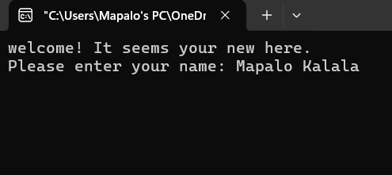
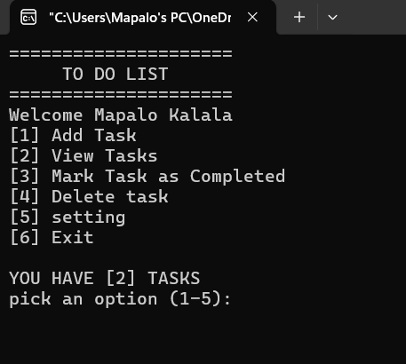
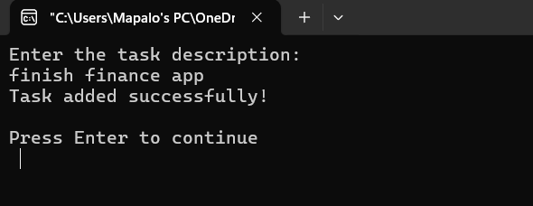
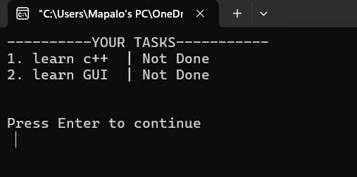
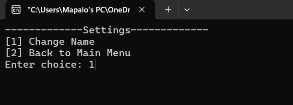

# TO DO LIST APPLICATION 🧾

## PROJECT OVERVIEW
* This is a simple **To-Do List** program written in **C++**. The program allows users to create, view, mark as completed, and delete tasks. It allows users to manage their tasks efficiently. The tasks are stored in a file named "task.txt" and are loaded into the program when it starts.
* **
## FEATURES ✨
- **Create new tasks :** The application allows the user to add new tasks.
- **View all tasks:** It provides a clean layout that allows users to view there taskings and the status whether they are done or not.  
- **Mark tasks as completed:** It allows users to change the status of the task from not done to done. This helps the users to know whether they have completed there tasks or not.
- **Delete tasks:** The program allows users to select which task they want to delete. Once the user selects the desired task, it delets it permanently.
- **Save tasks to a file:** Thorugh the use of the fstream library, it allows users to save the tasks. it saves the data in a file so that it can be retrived, edited and saved.
- **Load tasks from a file:** Through the use of the fstream library, it reads the data in the file, and tranfers it to a vector where it is then manipuleted through out the program.
- **User-friendly menu-based interface:** It provides a clean and user-friendly menu-based interface for navigation through the program
- **Input handleing:** The program inludes input validation to handle out of rang or nun numerical input choices through out the program.
- **User Name Functionallity:** The program allows the user to enter there name if they are a new user and saves it. it then displays there name every time they open the application
* **
## TEACHNOLOGIES USED ⛏️
* **Primary Language:** c++
* **Libraries Used:** 
-iostream:for input and output operations
-vector:used for easy manipulation of the data send to a vector. 
-string: for accessing functions stored in this library
-fstream:used to save and load data to and from file. it provides the technologies to manipulate the data written in the file the program creats
-limits:used for input buffer management during validation
* **

## HOW TO USE THE PROGRAM ⚙️

1. Running the Program

    - Compile the program using a C++ compiler (e.g., g++).
    - Run the resulting executable file.
2. Enter name if new user
    -The program will ask you to enter your name if you are a new user.
    
3. Main Menu

    - The program will display a menu with the following options:
        - Add Task
        - View Tasks
        - Mark Task as Completed
        - Delete Task
        - Exit
    - Enter the number of your chosen option.
    
4. Adding Tasks

    - Select the "Add Task" option.
    - Enter a description for the task.
    - The task will be added to the list.
    
5. Viewing Tasks

    - Select the "View Tasks" option.
    - The program will display a list of all tasks, including their status (completed or not completed).
    
6. Marking Tasks as Completed

    - Select the "Mark Task as Completed" option.
    - The program will display a list of all tasks.
    - Enter the number of the task you want to mark as completed.
    - The task will be marked as completed.
7. Deleting Tasks

    - Select the "Delete Task" option.
    - The program will display a list of all tasks.
    - Enter the number of the task you want to delete.
    - The task will be deleted.
8. Settings

    - select change name
        * Enter name

9. Exiting the Program

    - Select the "Exit" option.
    - The program will save the tasks to a file and exit.

* **
## WHAT I STRUGGLED WITH 🤯
* **Logic of the work flow**: It was a struggle for me to understand how the sections would navigate from page to page. During the development stage of this project, the exicutable file kept on breacking because of logic errors, errors related to the input buffer, infinte loops and type mismatch errors.
* **Using the limits library**: I struggled with using the limits library. it tool me a long time to understand the syntax and functions of the it.

* **
## WHAT I LEARNED 🧠
* **New Libraty(limits)**: During the development fase of this project, most of my time was spent learning and understanding the limits library.

* **
## IDEAS FOR FUTURE IMPROVEMENTS 🤔
-A function that allows the user to filter the tasks.
-a due date and time function that allows users to set due dates and time for tasks, and display them in the task list
-A task categorie funtion that allows the users to categorie task.
-A search funtion. implementing a search function to find specific task incase the tasks are a lot.
-User Authentification. Allowing user authentification so that the users tasks are protected.
* **
## Auther✒️
* **Mapalo Kalala**
* **Computer Science Student** 
* **2nd Year of Study**
* **The Copperbelt Univerity, Kitwe, Zambia**
